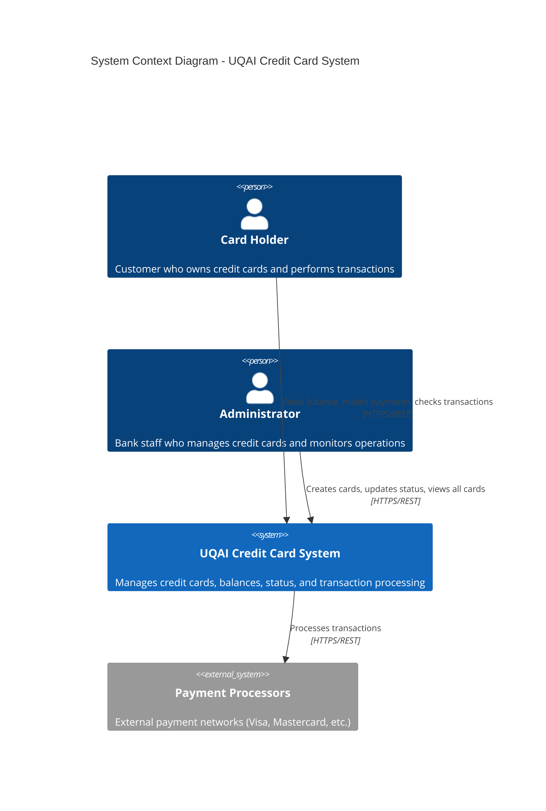
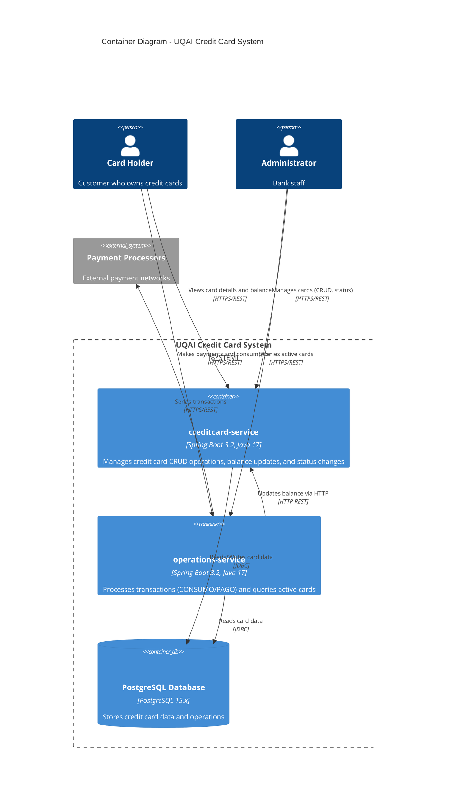

# UQAI Credit Card System Architecture

This document describes the architecture of the UQAI Credit Card System using the [C4 Model](https://c4model.com/), a visual approach to documenting software architecture at different levels of abstraction.

## About the C4 Model

The C4 Model provides a way to describe software architecture through four levels:
- **Level 1: System Context** - Shows the system as a box and its relationships with users and external systems
- **Level 2: Containers** - Shows the high-level technology choices and how responsibilities are distributed
- **Level 3: Components** - Shows the internal structure of containers and their interactions
- **Level 4: Code** (not documented here) - Represents the actual source code

---

## Level 1 - System Context

The System Context diagram shows the UQAI Credit Card System as a black box and its relationships with external actors and systems.



### Key Actors

| Actor | Description | Interactions |
|-------|-------------|--------------|
| **Card Holder** | Customer who owns credit cards | Views balance, makes payments, checks transactions |
| **Administrator** | Bank staff | Creates cards, updates status, views all cards |
| **Payment Processors** | External payment networks | Receives transaction processing requests |

---

## Level 2 - Containers

The Container diagram shows the high-level technology stack and how the system is structured into deployable units (containers).



### Technology Stack

| Container | Technology | Port | Responsibilities |
|-----------|------------|------|------------------|
| **creditcard-service** | Spring Boot 3.2, Java 17 | 9000 | Credit card CRUD, balance management, status updates |
| **operations-service** | Spring Boot 3.2, Java 17 | 9093 | Transaction processing, active card queries |
| **PostgreSQL Database** | PostgreSQL 15.x | 5432 | Persistence layer for both services |

### Communication Patterns

- **Card Holders** interact with both services via REST API
- **Administrators** manage cards through creditcard-service and query data through operations-service
- **operations-service** communicates with **creditcard-service** via HTTP REST to update card balances
- Both services share the same **PostgreSQL database** via JDBC

---

## Level 3 - Components

The Component diagrams show the internal structure of each service, following Hexagonal Architecture principles.

### creditcard-service Components

```mermaid
C4Component
    title Component Diagram - creditcard-service (Hexagonal Architecture)

    Person(admin, "Administrator", "Bank staff")
    Person(cardHolder, "Card Holder", "Customer")
    
    Container_Boundary(creditcardContainer, "creditcard-service [Port 9000]") {
        Component_Boundary(infrastructureLayer, "Infrastructure Layer") {
            Component(restController, "CreditCardController", "Spring REST Controller", "Handles HTTP requests: GET, POST, PATCH /api/v1/creditcards")
            Component(restMapper, "CreditCardRestMapper", "MapStruct Mapper", "Maps between DTOs and Domain models")
            Component(persistenceAdapter, "CreditCardPersistenceAdapter", "JPA Adapter", "Implements LoadCreditCardPort and SaveCreditCardPort")
            Component(jpaRepo, "CreditCardJpaRepository", "Spring Data JPA", "JPA repository interface for database access")
            Component(persistenceMapper, "CreditCardPersistenceMapper", "MapStruct Mapper", "Maps between Entity and Domain models")
            Component(globalException, "GlobalExceptionHandler", "Spring @ControllerAdvice", "Handles domain exceptions and returns HTTP errors")
        }
        
        Component_Boundary(applicationLayer, "Application Layer") {
            Component(createService, "CreateCreditCardService", "Spring @Service", "Implements CreateCreditCardUseCase")
            Component(getService, "GetCreditCardService", "Spring @Service", "Implements GetCreditCardUseCase")
            Component(updateStatusService, "UpdateCreditCardStatusService", "Spring @Service", "Implements UpdateCreditCardStatusUseCase")
            Component(updateBalanceService, "UpdateBalanceService", "Spring @Service", "Implements UpdateBalanceUseCase")
        }
        
        Component_Boundary(domainLayer, "Domain Layer") {
            Component(creditCard, "CreditCard", "Domain Entity", "Core business entity with cardNumber, balance, status, limits")
            Component(cardStatus, "CreditCardStatus", "Enum", "ACTIVA, BLOQUEADA")
            Component(operationType, "OperationType", "Enum", "CONSUMO, PAGO")
            Component(cardRepo, "CreditCardRepository", "Repository Interface", "Port for persistence operations")
        }
    }
    
    ContainerDb(postgresDB, "PostgreSQL Database", "PostgreSQL 15.x", "Stores credit card entities")

    Rel(admin, restController, "Makes requests", "HTTPS/REST")
    Rel(cardHolder, restController, "Views card", "HTTPS/REST")
    
    Rel(restController, createService, "Uses", "CreateCreditCardUseCase")
    Rel(restController, getService, "Uses", "GetCreditCardUseCase")
    Rel(restController, updateStatusService, "Uses", "UpdateCreditCardStatusUseCase")
    Rel(restController, updateBalanceService, "Uses", "UpdateBalanceUseCase")
    Rel(restController, restMapper, "Maps DTOs", "MapStruct")
    
    Rel(createService, cardRepo, "Persists", "SaveCreditCardPort")
    Rel(getService, cardRepo, "Queries", "LoadCreditCardPort")
    Rel(updateStatusService, cardRepo, "Updates", "SaveCreditCardPort")
    Rel(updateBalanceService, cardRepo, "Updates", "SaveCreditCardPort")
    
    Rel(cardRepo, persistenceAdapter, "Implemented by", "Adapter Pattern")
    Rel(persistenceAdapter, jpaRepo, "Uses", "Spring Data JPA")
    Rel(persistenceAdapter, persistenceMapper, "Maps entities", "MapStruct")
    Rel(jpaRepo, postgresDB, "Persists", "JDBC")

    UpdateLayoutConfig($c4ShapeInRow="3", $c4ShapeWidth="auto")
```

#### Architecture Layers

1. **Infrastructure Layer**: REST Controllers, Exception Handlers, and Persistence Adapters
   - `CreditCardController`: Handles HTTP requests and delegates to services
   - `CreditCardPersistenceAdapter`: Implements repository ports using JPA
   - Mappers: Convert between DTOs, Entities, and Domain models

2. **Application Layer**: Use case implementations (Services)
   - `CreateCreditCardService`: Creates new credit cards
   - `GetCreditCardService`: Retrieves card information
   - `UpdateCreditCardStatusService`: Updates card status (ACTIVA/BLOQUEADA)
   - `UpdateBalanceService`: Updates card balance (for CONSUMO/PAGO operations)

3. **Domain Layer**: Core business logic
   - `CreditCard`: Domain entity with business rules
   - `CreditCardRepository`: Port interface for persistence
   - Enums: `CreditCardStatus`, `OperationType`

### operations-service Components

```mermaid
C4Component
    title Component Diagram - operations-service (Hexagonal Architecture)

    Person(cardHolder, "Card Holder", "Customer who makes transactions")
    Person(admin, "Administrator", "Bank staff")
    
    Container_Boundary(operationsContainer, "operations-service [Port 9093]") {
        Component_Boundary(infrastructureLayer, "Infrastructure Layer") {
            Component(operationController, "OperationController", "Spring REST Controller", "Handles POST /api/v1/operations")
            Component(creditCardController, "CreditCardController", "Spring REST Controller", "Handles GET /api/v1/creditcards/active")
            Component(restMapper, "CreditCardRestMapper", "MapStruct Mapper", "Maps DTOs to Domain models")
            Component(creditCardClient, "CreditCardClient", "RestTemplate Client", "HTTP client to communicate with creditcard-service:9000")
            Component(persistenceAdapter, "CreditCardQueryRepositoryImpl", "JPA Adapter", "Implements CreditCardQueryRepository")
            Component(jpaRepo, "CreditCardJpaRepository", "Spring Data JPA", "JPA repository for local queries")
            Component(persistenceMapper, "CreditCardPersistenceMapper", "MapStruct Mapper", "Maps Entity to Domain")
            Component(globalException, "GlobalExceptionHandler", "Spring @ControllerAdvice", "Handles exceptions")
            Component(beanConfig, "BeanConfiguration", "Spring @Configuration", "Configures beans, RestTemplate, service wiring")
        }
        
        Component_Boundary(applicationLayer, "Application Layer") {
            Component(processOperationService, "ProcessOperationService", "Spring @Service", "Implements ProcessOperationUseCase - coordinates balance updates")
            Component(getActiveCardsService, "GetActiveCreditCardsService", "Spring @Service", "Implements GetActiveCreditCardsUseCase")
        }
        
        Component_Boundary(domainLayer, "Domain Layer") {
            Component(creditCard, "CreditCard", "Domain Entity", "Local representation of credit card data")
            Component(cardStatus, "CreditCardStatus", "Enum", "ACTIVA, BLOQUEADA")
            Component(operationType, "OperationType", "Enum", "CONSUMO, PAGO")
            Component(queryRepo, "CreditCardQueryRepository", "Repository Interface", "Port for querying active cards")
        }
    }
    
    Container(creditcardService, "creditcard-service", "Spring Boot 3.2, Port 9000", "External service for balance updates")
    ContainerDb(postgresDB, "PostgreSQL Database", "PostgreSQL 15.x", "Stores credit card data")

    Rel(cardHolder, operationController, "Makes transactions", "HTTPS/REST", "POST /api/v1/operations")
    Rel(admin, creditCardController, "Queries active cards", "HTTPS/REST", "GET /api/v1/creditcards/active")
    
    Rel(operationController, processOperationService, "Uses", "ProcessOperationUseCase")
    Rel(creditCardController, getActiveCardsService, "Uses", "GetActiveCreditCardsUseCase")
    
    Rel(processOperationService, creditCardClient, "Calls HTTP API", "RestTemplate")
    Rel(creditCardClient, creditcardService, "Updates balance", "HTTP PATCH /api/v1/creditcards/{id}/balance")
    
    Rel(getActiveCardsService, queryRepo, "Queries", "CreditCardQueryRepository")
    Rel(queryRepo, persistenceAdapter, "Implemented by", "Adapter Pattern")
    Rel(persistenceAdapter, jpaRepo, "Uses", "Spring Data JPA")
    Rel(persistenceAdapter, persistenceMapper, "Maps", "MapStruct")
    Rel(jpaRepo, postgresDB, "Reads", "JDBC")

    UpdateLayoutConfig($c4ShapeInRow="3", $c4ShapeWidth="auto")
```

#### Key Components

1. **HTTP Client**: `CreditCardClient` uses RestTemplate to communicate with creditcard-service for balance updates
2. **Controllers**: Separate controllers for operations and credit card queries
3. **Services**: `ProcessOperationService` coordinates transaction processing including external balance updates

---

## REST API Endpoints

### creditcard-service (Port 9000)

| Method | Endpoint | Description |
|--------|----------|-------------|
| `GET` | `/api/v1/creditcards` | List all cards |
| `GET` | `/api/v1/creditcards/{id}` | Get card by ID |
| `POST` | `/api/v1/creditcards` | Create new card |
| `PATCH` | `/api/v1/creditcards/{id}/status` | Update card status |
| `PATCH` | `/api/v1/creditcards/{id}/balance` | Update balance (CONSUMO/PAGO) |

### operations-service (Port 9093)

| Method | Endpoint | Description |
|--------|----------|-------------|
| `POST` | `/api/v1/operations` | Process transaction (consumption/payment) |
| `GET` | `/api/v1/creditcards/active` | Get all active credit cards |

---

## Data Flow: Transaction Processing

```
Card Holder
    │
    │ POST /api/v1/operations
    ▼
┌─────────────────────┐
│ operations-service  │────┐
│ OperationController │    │
└─────────────────────┘    │
    │                      │
    │                      │
    ▼                      │
┌─────────────────────┐    │
│ ProcessOperation    │    │ 2. Calls creditCardClient
│ Service             │    │
└─────────────────────┘    │
    │                      │
    │                      │
    ▼                      │
┌─────────────────────┐    │
│ CreditCardClient    │────┘
└─────────────────────┘
    │
    │ PATCH /api/v1/creditcards/{id}/balance
    ▼
┌─────────────────────┐
│ creditcard-service  │
│ UpdateBalanceService│
└─────────────────────┘
    │
    ▼
┌─────────────────────┐
│ PostgreSQL DB       │
└─────────────────────┘
```

---

## Architecture Patterns

### Hexagonal Architecture (Clean Architecture)

The system follows Hexagonal Architecture principles:

- **Domain Layer**: Contains business logic, independent of frameworks
- **Application Layer**: Orchestrates use cases, defines ports (interfaces)
- **Infrastructure Layer**: Implements ports with specific technologies (Spring, JPA)

### Benefits

- **Testability**: Domain logic can be tested without Spring context
- **Maintainability**: Technology changes don't affect business logic
- **Flexibility**: Easy to swap implementations (e.g., database, HTTP client)

---

## File Structure

```
docs/architecture/
├── ARCHITECTURE.md              # This file - complete architecture documentation
├── C1-context.mmd               # C4 Context diagram
├── C2-containers.mmd            # C4 Container diagram
├── C3-creditcard-service.mmd    # C4 Component diagram for creditcard-service
└── C3-operations-service.mmd    # C4 Component diagram for operations-service
```

---

## Related Documentation

- [API Documentation](../../API-DOCUMENTATION.md) - Complete API reference
- [README](../../README.md) - Project overview and quick start
- [docker-compose.yml](../../docker-compose.yml) - Local development setup
