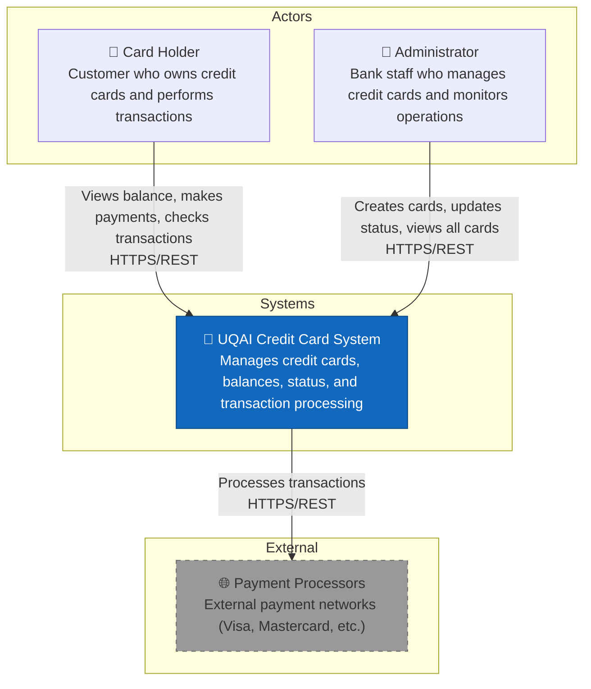
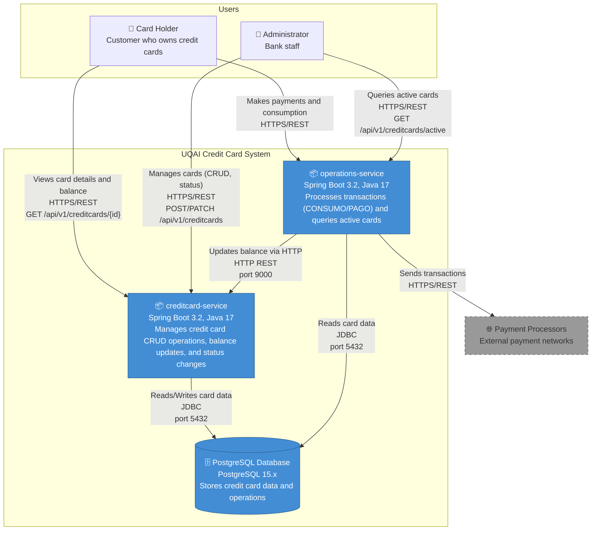
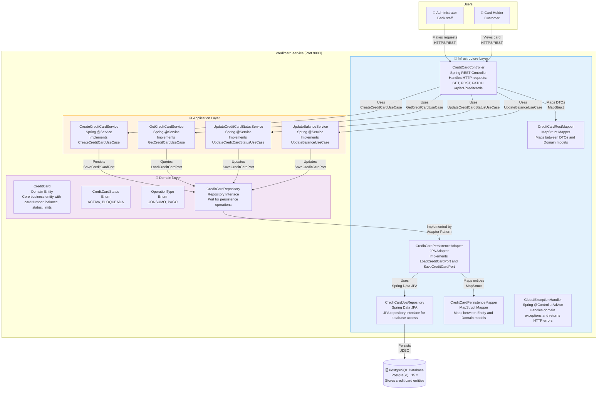
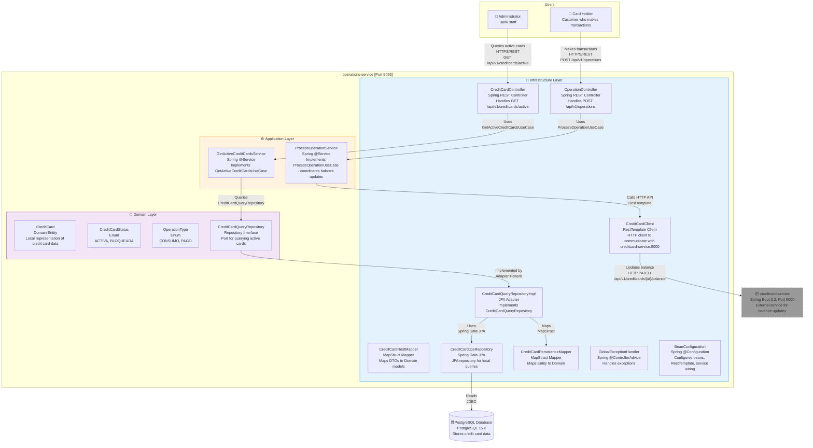

# UQAI Credit Card System Architecture

This document describes the architecture of the UQAI Credit Card System using the [C4 Model](https://c4model.com/), a visual approach to documenting software architecture at different levels of abstraction.

## About the C4 Model

The C4 Model provides a way to describe software architecture through four levels:
- **Level 1: System Context** - Shows the system as a box and its relationships with users and external systems
- **Level 2: Containers** - Shows the high-level technology choices and how responsibilities are distributed
- **Level 3: Components** - Shows the internal structure of containers and their interactions
- **Level 4: Code** (not documented here) - Represents the actual source code

---

## Level 1 - System Context

The System Context diagram shows the UQAI Credit Card System as a black box and its relationships with external actors and systems.



### Key Actors

| Actor | Description | Interactions |
|-------|-------------|--------------|
| **Card Holder** | Customer who owns credit cards | Views balance, makes payments, checks transactions |
| **Administrator** | Bank staff | Creates cards, updates status, views all cards |
| **Payment Processors** | External payment networks | Receives transaction processing requests |

---

## Level 2 - Containers

The Container diagram shows the high-level technology stack and how the system is structured into deployable units (containers).



### Technology Stack

| Container | Technology | Port | Responsibilities |
|-----------|------------|------|------------------|
| **creditcard-service** | Spring Boot 3.2, Java 17 | 9000 | Credit card CRUD, balance management, status updates |
| **operations-service** | Spring Boot 3.2, Java 17 | 9093 | Transaction processing, active card queries |
| **PostgreSQL Database** | PostgreSQL 15.x | 5432 | Persistence layer for both services |

### Communication Patterns

- **Card Holders** interact with both services via REST API
- **Administrators** manage cards through creditcard-service and query data through operations-service
- **operations-service** communicates with **creditcard-service** via HTTP REST to update card balances
- Both services share the same **PostgreSQL database** via JDBC

---

## Level 3 - Components

The Component diagrams show the internal structure of each service, following Hexagonal Architecture principles.

### creditcard-service Components



#### Architecture Layers

1. **Infrastructure Layer**: REST Controllers, Exception Handlers, and Persistence Adapters
   - `CreditCardController`: Handles HTTP requests and delegates to services
   - `CreditCardPersistenceAdapter`: Implements repository ports using JPA
   - Mappers: Convert between DTOs, Entities, and Domain models

2. **Application Layer**: Use case implementations (Services)
   - `CreateCreditCardService`: Creates new credit cards
   - `GetCreditCardService`: Retrieves card information
   - `UpdateCreditCardStatusService`: Updates card status (ACTIVA/BLOQUEADA)
   - `UpdateBalanceService`: Updates card balance (for CONSUMO/PAGO operations)

3. **Domain Layer**: Core business logic
   - `CreditCard`: Domain entity with business rules
   - `CreditCardRepository`: Port interface for persistence
   - Enums: `CreditCardStatus`, `OperationType`

### operations-service Components



#### Key Components

1. **HTTP Client**: `CreditCardClient` uses RestTemplate to communicate with creditcard-service for balance updates
2. **Controllers**: Separate controllers for operations and credit card queries
3. **Services**: `ProcessOperationService` coordinates transaction processing including external balance updates

---

## REST API Endpoints

### creditcard-service (Port 9000)

| Method | Endpoint | Description |
|--------|----------|-------------|
| `GET` | `/api/v1/creditcards` | List all cards |
| `GET` | `/api/v1/creditcards/{id}` | Get card by ID |
| `POST` | `/api/v1/creditcards` | Create new card |
| `PATCH` | `/api/v1/creditcards/{id}/status` | Update card status |
| `PATCH` | `/api/v1/creditcards/{id}/balance` | Update balance (CONSUMO/PAGO) |

### operations-service (Port 9093)

| Method | Endpoint | Description |
|--------|----------|-------------|
| `POST` | `/api/v1/operations` | Process transaction (consumption/payment) |
| `GET` | `/api/v1/creditcards/active` | Get all active credit cards |

---

## Data Flow: Transaction Processing

```
Card Holder
    │
    │ POST /api/v1/operations
    ▼
┌─────────────────────┐
│ operations-service  │────┐
│ OperationController │    │
└─────────────────────┘    │
    │                      │
    │                      │
    ▼                      │
┌─────────────────────┐    │
│ ProcessOperation    │    │ 2. Calls creditCardClient
│ Service             │    │
└─────────────────────┘    │
    │                      │
    │                      │
    ▼                      │
┌─────────────────────┐    │
│ CreditCardClient    │────┘
└─────────────────────┘
    │
    │ PATCH /api/v1/creditcards/{id}/balance
    ▼
┌─────────────────────┐
│ creditcard-service  │
│ UpdateBalanceService│
└─────────────────────┘
    │
    ▼
┌─────────────────────┐
│ PostgreSQL DB       │
└─────────────────────┘
```

---

## Architecture Patterns

### Hexagonal Architecture (Clean Architecture)

The system follows Hexagonal Architecture principles:

- **Domain Layer**: Contains business logic, independent of frameworks
- **Application Layer**: Orchestrates use cases, defines ports (interfaces)
- **Infrastructure Layer**: Implements ports with specific technologies (Spring, JPA)

### Benefits

- **Testability**: Domain logic can be tested without Spring context
- **Maintainability**: Technology changes don't affect business logic
- **Flexibility**: Easy to swap implementations (e.g., database, HTTP client)

---

## File Structure

```
docs/architecture/
├── ARCHITECTURE.md              # This file - complete architecture documentation
├── C1-context.mmd               # C4 Context diagram
├── C2-containers.mmd            # C4 Container diagram
├── C3-creditcard-service.mmd    # C4 Component diagram for creditcard-service
└── C3-operations-service.mmd    # C4 Component diagram for operations-service
```

---

## Related Documentation

- [API Documentation](../../API-DOCUMENTATION.md) - Complete API reference
- [README](../../README.md) - Project overview and quick start
- [docker-compose.yml](../../docker-compose.yml) - Local development setup
